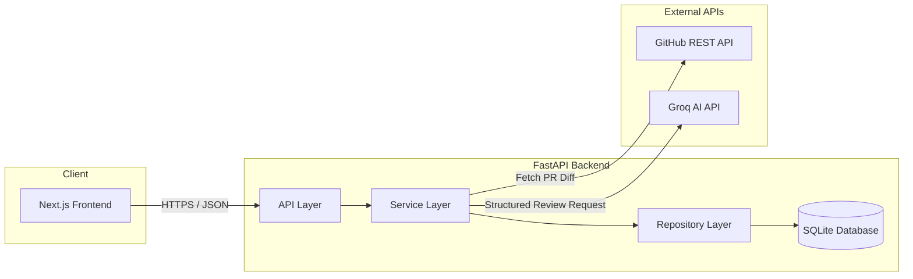
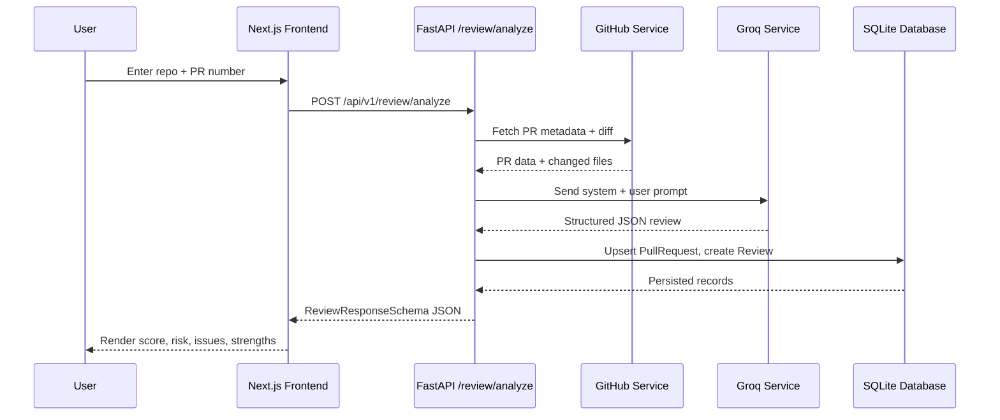
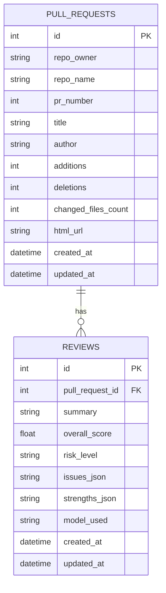
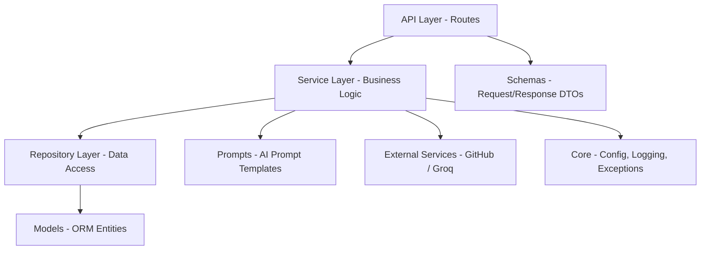

# Architecture

## 1. System Architecture

```mermaid
flowchart LR
    subgraph Client
        UI[Next.js Frontend]
    end

    subgraph Backend["FastAPI Backend"]
        API[API Layer]
        SVC[Service Layer]
        REPO[Repository Layer]
        DB[(SQLite Database)]
    end

    subgraph External["External APIs"]
        GH[GitHub REST API]
        GROQ[Groq AI API]
    end

    UI -->|HTTPS / JSON| API
    API --> SVC
    SVC --> REPO
    REPO --> DB
    SVC -->|Fetch PR Diff| GH
    SVC -->|Structured Review Request| GROQ
```

## 2. Review Request Sequence

```mermaid
sequenceDiagram
    participant U as User
    participant FE as Next.js Frontend
    participant API as FastAPI /review/analyze
    participant GH as GitHub Service
    participant AI as Groq Service
    participant DB as SQLite Database

    U->>FE: Enter repo + PR number
    FE->>API: POST /api/v1/review/analyze
    API->>GH: Fetch PR metadata + diff
    GH-->>API: PR data + changed files
    API->>AI: Send system + user prompt
    AI-->>API: Structured JSON review
    API->>DB: Upsert PullRequest, create Review
    DB-->>API: Persisted records
    API-->>FE: ReviewResponseSchema JSON
    FE-->>U: Render score, risk, issues, strengths
```

## 3. Database Entity Relationship

```mermaid
erDiagram
    PULL_REQUESTS ||--o{ REVIEWS : has
    PULL_REQUESTS {
        int id PK
        string repo_owner
        string repo_name
        int pr_number
        string title
        string author
        int additions
        int deletions
        int changed_files_count
        string html_url
        datetime created_at
        datetime updated_at
    }
    REVIEWS {
        int id PK
        int pull_request_id FK
        string summary
        float overall_score
        string risk_level
        string issues_json
        string strengths_json
        string model_used
        datetime created_at
        datetime updated_at
    }
```

## 4. Clean Architecture Layering

```mermaid
flowchart TD
    A[API Layer - Routes] --> B[Service Layer - Business Logic]
    B --> C[Repository Layer - Data Access]
    C --> D[Models - ORM Entities]
    B --> E[Prompts - AI Prompt Templates]
    B --> F[External Services - GitHub / Groq]
    A --> G[Schemas - Request/Response DTOs]
    B --> H[Core - Config, Logging, Exceptions]
```
