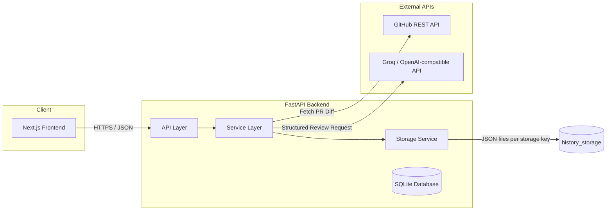
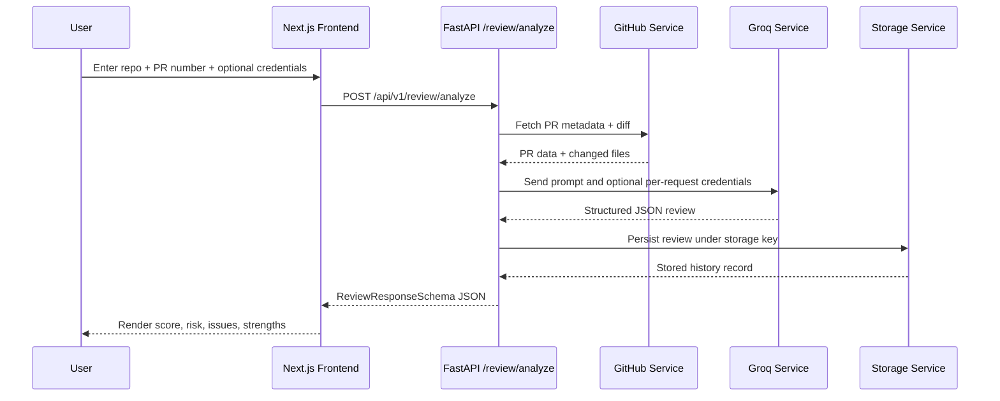
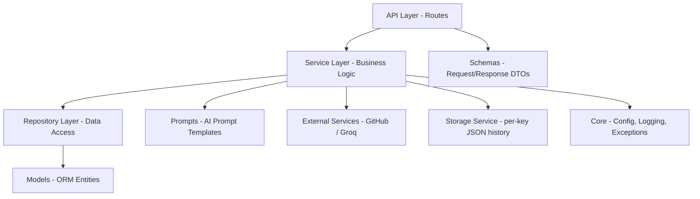

# Architecture

## 1. System Architecture

## 2. Review Request Sequence

## 3. Storage Model

History is no longer shared globally. Each storage key maps to its own JSON file in the history storage directory, which keeps review history isolated per user or session.

## 4. Clean Architecture Layering

